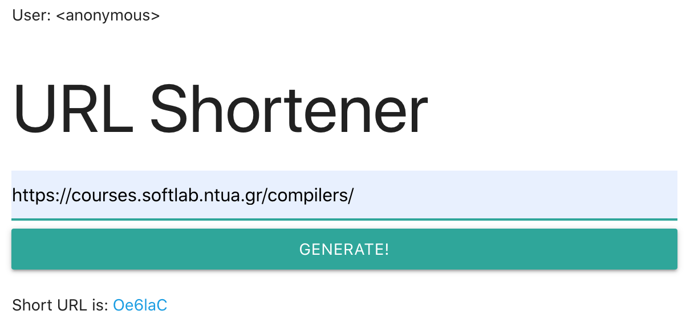

# A simple web application: URL shortener

This is a simple web application which allows users to generate
short tracked URLs from longer ones.  A short URL redirects to
the original URL, when followed.  It is tracked in the sense that
a counter is incremented, every time the URL is followed.

This application is used as a laboratory case study for the course
in [Software Engineering](https://courses.softlab.ntua.gr/softeng/)
taught in the Fall of 2020 at the [School of Electrical and Computer
  Engineering](https://www.ece.ntua.gr/)
of the [National Technical University of Athens](https://www.ntua.gr).


## Technology stack

1. Backend using Java [Spring](https://spring.io/)
2. MySQL database, although this can change very easily
3. Frontend using [React](https://reactjs.org/)


## How to set it up

1.  Backend

    ```sh
    cd backend/src/main/resources
    cp application.properties.sample application.properties
    edit application.properties
    ```

    Specify the URL to the database to be used, username and password.
    The database and corresponding user **must exist** before the backend
    is launched.

    Then, launch the backend in one terminal:

    ```sh
    cd backend
    ./gradlew bootRun
    ```

2.  Frontend

    ```sh
    cd frontend/
    yarn install
    ```

    Then launch the frontend in another terminal:

    ```sh
    cd frontend/
    yarn start
    ```

    and navigate to <http://localhost:3000/>.  It should look like this:

    

---

## Maintainer

- [Νίκος Παπασπύρου](https://www.softlab.ntua.gr/~nickie/)
   \<<nickie@softlab.ntua.gr>\>
